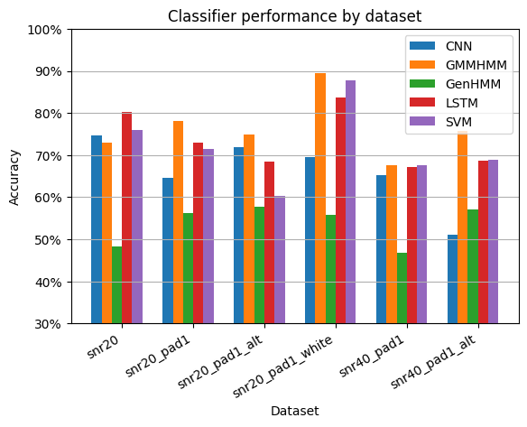
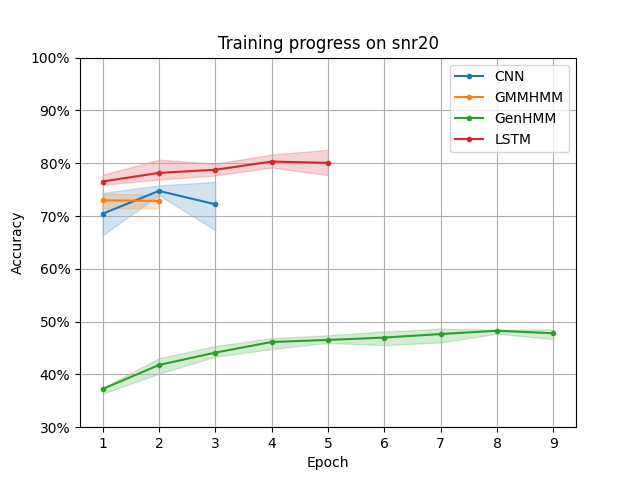
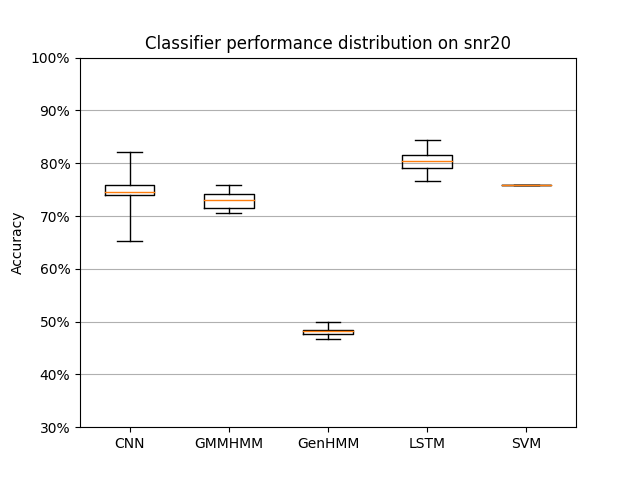

# Degree Project Prestudy
The code for the experimental part of the prestudy for my degree project, where five types of classifiers are tested on noisy speech. Please refer to [the report](Degree_Project_Prestudy.pdf) for details.

Relies on [https://github.com/FirstHandScientist/genhmm](https://github.com/FirstHandScientist/genhmm) for the GenHMM and GMMHMM implementations (which in turn requires PyTorch, CUDA, etc.), and Matlab and the [Audio Degradation Toolbox](https://code.soundsoftware.ac.uk/projects/audio-degradation-toolbox) for dataset generation. Noise samples are included but not the TIMIT database.

## Some pretty graphs
The optimal (that I found) average performance across 10 instances of each classifier type (except SVM, as it had no element of randomness).

Accuracy on the test set over time on one of the datasets. Training is stopped when this accuracy no longer increases, which is why each line ends with a dip. The second-to-last epoch is then used for comparison. The colored region displays the [interquartile range](https://en.wikipedia.org/wiki/Interquartile_range).

Accuracy distribution of each classifier, evaluated in the second-to-last epochs. The box shows the interquartile range and the whiskers the maximum and minimum values. The yellow line is the median.

